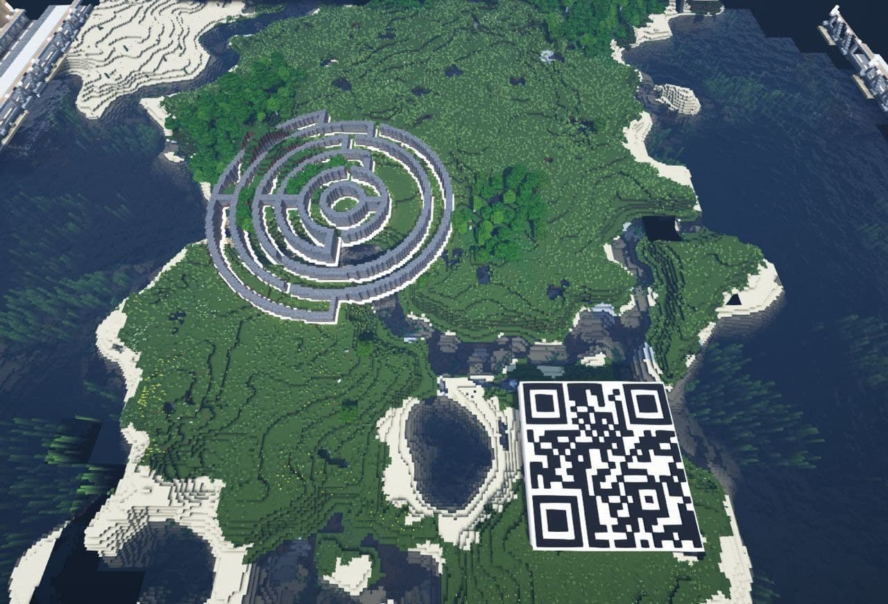
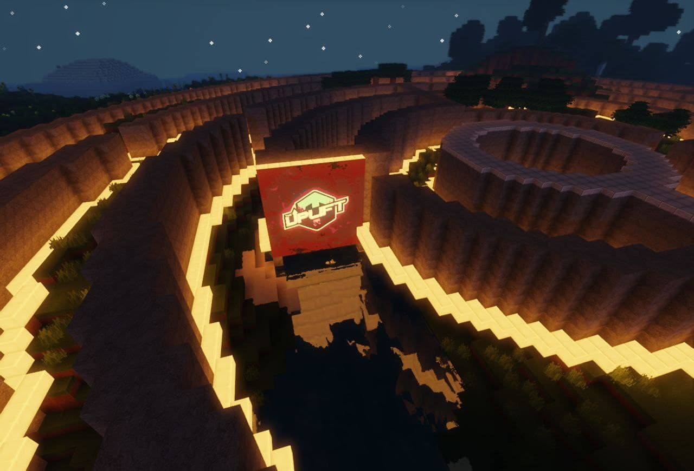
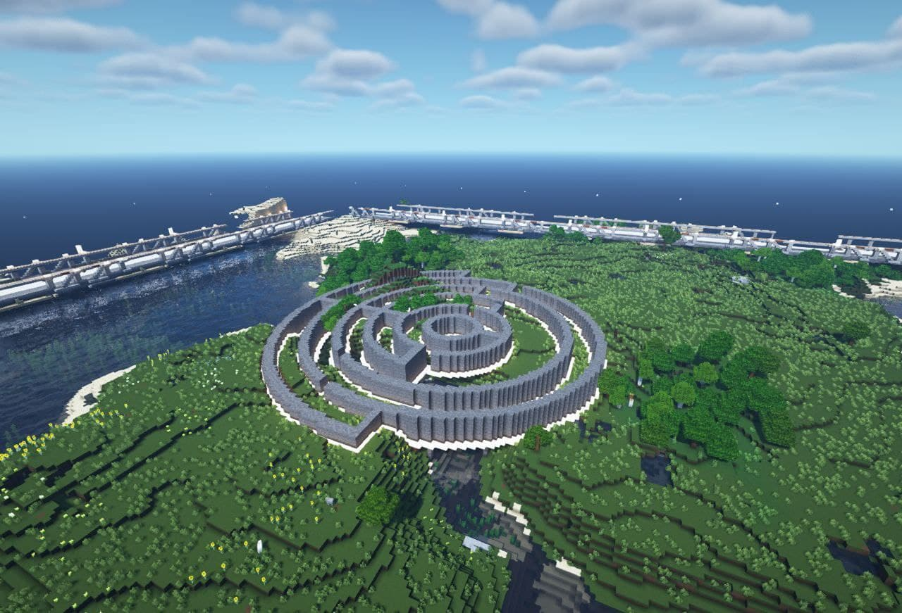

# #31: Create Effect.ai plot in "The Uplift" NFT property platform (C6)



This was a task based proposal that requested EFX in exchange for building a Boid and Blockbase plot for the Effect Network on The Uplift.&#x20;



Documentation of completion was provided by @ghobson on Telegram.&#x20;

&#x20;

